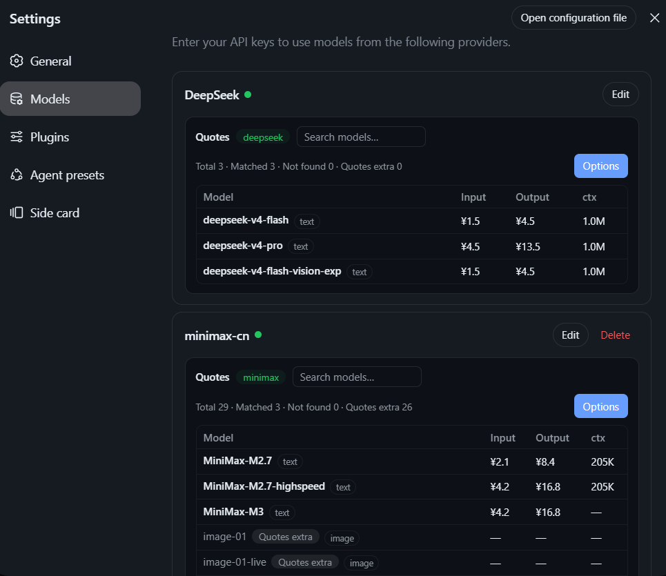

# dsh-LLM-quotes
<p align="left">
  <a href="https://github.com/deepseek-ai"></a>
  <a href="https://github.com/deepseek-ai"></a>
  <a href="LICENSE"></a>
</p>

 [中文](#中文)
 
> Latest LLM provider API prices, right inside **DeepSeek Harness (dsh)** → **Settings → Models**.

A dsh web plugin that shows current LLM API prices for every provider you have configured. Each provider card gets a compact **Quotes** block with per-model input/output prices and a details popup — no tab-switching, no manual lookups.

Data is sourced from [LLMRates.ai](https://www.llmrates.ai) (free, read-only, no API key, updated daily) and cached locally.


## What

`dsh-LLM-quotes` injects a **Quotes** block under every **Settings → Models** provider card in dsh:

- Per-model **input / output** prices (per 1M tokens by default).
- A **Details** popup showing every valued model field — context window, max output, modalities, capabilities, release/knowledge dates, and all price rows (tiers, unit, region, source).
- Smart matching from dsh provider routes to LLMRates slugs, with manual association only as a last resort.

There is **no separate Watch step** — configured models are implicitly priced.

## Why

LLM prices change constantly and live across a dozen vendor pages. This plugin keeps current quotes in the one place you already manage your models, so you can sanity-check costs while configuring a provider — without leaving the settings dialog.

## Install

Requires a running DeepSeek Harness (**dsh**) **web** profile (Node.js ≥ 22.19 or ≥ 24).

Install this plugin into your web profile with the dsh CLI:

```bash
dsh plugin --profile web add "github:v587d/dsh-llm-quotes"
```

For a reproducible, tamper-resistant install, pin a commit SHA instead of a moving branch:

```bash
dsh plugin --profile web add "github:v587d/dsh-llm-quotes#<commit-sha>"
```

Then (re)launch the web profile and open **Settings → Models** — each provider card now shows a Quotes block:

```bash
dsh --profile web        # or: npx @deepseek-ai/dsh web
```

> Plugins are third-party code that runs with your agent's privileges and may run install-time build scripts. Review the source and pin a commit before installing — see the [dsh plugin docs](https://github.com/deepseek-ai/deepseek-harness).

### Building from source (development)

To hack on the plugin or build it yourself, clone the repo and use pnpm:

```bash
pnpm install
pnpm run build        # outputs lib/ (host half) + lib/client.js (browser half)
pnpm run typecheck    # optional: type check
pnpm test             # optional: run unit tests
```

The bundle patch in `cordis.patch.yml` registers the host plugin row; the browser half is a `window.__ModuleLoader__` module and the host half a Cordis plugin exposing same-origin `/api/llm-quotes` JSON routes (LLMRates.ai is never called directly from the page).

## Features

- **Per-provider quote blocks** in Settings → Models (one block per configured provider).
- **Model details popup** — every valued model-level field and price row.
- **Slug-based provider matching** — alias map + provider-level association; per-model association only as a last resort.
- **Daily auto-sync** — dataset refreshed at most once per calendar day; serves the last good local snapshot on failure.
- **Local-only persistence** — settings & associations in `~/.dsh/llm-quotes.json`; dataset snapshot in `~/.dsh/llm-quotes-data.json`. No accounts, no telemetry, no cloud.
- **Plan-aware** — token/coding plans are excluded from provider association (only usage-based API pricing is shown).

## Data Source & Attribution

Pricing data is provided by **LLMRates.ai** and is free, read-only, and updated daily. Per their redistribution terms, the source is attributed:

<a href="https://www.llmrates.ai" target="_blank" rel="noopener">LLM &amp; GenAI pricing data by LLMRates.ai</a>

## Roadmap

- **Price-trend tracking** — chart historical prices for the models you actually use and surface changes over time.
- **Watchlist & alerts** — pin specific models/providers and get notified on price drops or increases.
- **Compare view** — side-by-side pricing across providers (the standalone prices panel is already built and staged for this migration).
- **More locales** — beyond English / Simplified Chinese.

## Contributing

PRs and issues are welcome! The project is iterating quickly right now, so please **rebase** your branch onto the latest `master` before opening a PR to avoid messy merge conflicts.

## Screenshot



## License

MIT.

---

# 中文

> 最新的大模型（LLM）厂商 API 价格，直接显示在 **DeepSeek Harness（dsh）** 的 **设置 → 模型** 页面中。

这是一个 dsh Web 插件，会为你已配置的每一个厂商展示当前的 LLM API 价格。每个厂商卡片下方都会插入一个简洁的 **报价（Quotes）** 区块，包含每个模型的输入/输出价格，以及详情弹窗——无需切换标签页，也无需手动查询。

价格数据来自 [LLMRates.ai](https://www.llmrates.ai)（免费、只读、无需 API Key、每日更新），并在本地缓存。

## 这是什么

`dsh-llm-quotes` 会在 dsh 的 **设置 → 模型** 页面中，为每个厂商卡片下方注入一个 **报价** 区块：

- 每个模型的 **输入 / 输出** 价格（默认按每百万 token 计价）。
- 一个 **详情** 弹窗，展示模型的所有有效字段——上下文窗口、最大输出、模态、能力、发布/知识截止日期，以及全部价格行（档位、计价单位、区域、来源）。
- 智能匹配：从 dsh 厂商路由映射到 LLMRates 的 slug，仅在最后兜底时才需要手动关联。

本插件 **没有独立的「监控 / Watch」步骤**——已配置的模型即为隐式纳入报价。

## 为什么

LLM 价格变动频繁，且分散在各家厂商的页面中。本插件把最新报价放在你本来就管理模型的地方，让你在配置厂商的同时就能核对成本——不必离开设置对话框。

## 安装

环境要求：已运行的 DeepSeek Harness（**dsh**）**Web** 配置文件（Node.js ≥ 22.19 或 ≥ 24）。

使用 dsh 命令行将该插件安装到你的 Web 配置中：

```bash
dsh plugin --profile web add "github:v587d/dsh-llm-quotes"
```

若希望安装可复现、防篡改，建议固定到具体的 commit SHA，而不是会移动的分支：

```bash
dsh plugin --profile web add "github:v587d/dsh-llm-quotes#<commit-sha>"
```

随后（重新）启动 Web 配置并打开 **设置 → 模型**，每个厂商卡片下方即会出现报价区块：

```bash
dsh --profile web        # 或：npx @deepseek-ai/dsh web
```

> 插件属于第三方代码，会以你 agent 的权限运行，并可能在安装时执行构建脚本。安装前请审阅源码并固定到具体 commit——参见 [dsh 插件文档](https://github.com/deepseek-ai/deepseek-harness)。

### 从源码构建（开发）

如需改动插件或自行构建，克隆本仓库并使用 pnpm：

```bash
pnpm install
pnpm run build        # 生成 lib/（主机端）与 lib/client.js（浏览器端）
pnpm run typecheck    # 可选：类型检查
pnpm test             # 可选：运行单元测试
```

仓库中的 `cordis.patch.yml` 会注册主机端插件行；浏览器端是一个 `window.__ModuleLoader__` 模块，主机端是一个 Cordis 插件，对外暴露同源的 `/api/llm-quotes` JSON 接口（页面不会直接调用 LLMRates.ai）。

## 功能

- **按厂商展示报价区块**：在「设置 → 模型」中，每个已配置厂商各显示一块报价。
- **模型详情弹窗**：展示模型所有有效字段与价格行。
- **基于 slug 的厂商匹配**：内置别名映射 + 厂商级关联；仅在最后兜底时做模型级手动关联。
- **每日自动同步**：数据每天最多刷新一次；失败时继续提供上一次成功的本地快照。
- **纯本地存储**：设置与关联存于 `~/.dsh/llm-quotes.json`，数据集快照存于 `~/.dsh/llm-quotes-data.json`。无账号、无埋点、无云端。
- **区分订阅计划**：厂商关联时会排除 Token / Coding Plan 等订阅型计划，仅展示按量计费（per-token）的 API 价格。

## 数据来源与署名

价格数据由 **LLMRates.ai** 提供，免费、只读、每日更新。根据其再分发条款，须标注数据来源：

<a href="https://www.llmrates.ai" target="_blank" rel="noopener">LLM &amp; GenAI pricing data by LLMRates.ai</a>

## 路线图

- **价格走势跟踪**：基于你常用的模型，绘制历史价格曲线并提示变化。
- **关注列表与提醒（Watchlist）**：收藏特定模型 / 厂商，价格涨跌时及时提醒。
- **对比视图**：跨厂商并排比价（独立价格面板已构建，待迁移至此）。
- **更多语言**：在英文 / 简体中文之外增加更多语言。

## 贡献

欢迎提交 PR 与 Issue！项目近期迭代频繁，请在提交 PR 前将分支 **rebase** 到最新的 `master`，以避免复杂的合并冲突。

## 截图


## 许可证

MIT。
